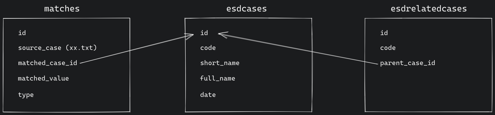

# ESD citations

## Project goals
- scrape esd cases data from [curia](https://curia.europa.eu)
- extract additional cases data from csv exports in `/esd-cases-fetcher/csv_source`
- combine both datasets and create db structure
- find all esd cases citations in `/source_data` (not included in repository)
- create relations between matched citations and esd cases in db

## Components

### esd-cases-fetcher
multiple python scripts for initializing database, scraping data from web and extracting data from csv files
### cases-worker
main app written in Rust, handles searching for citations in source data by set of defined rules

## DB structure
